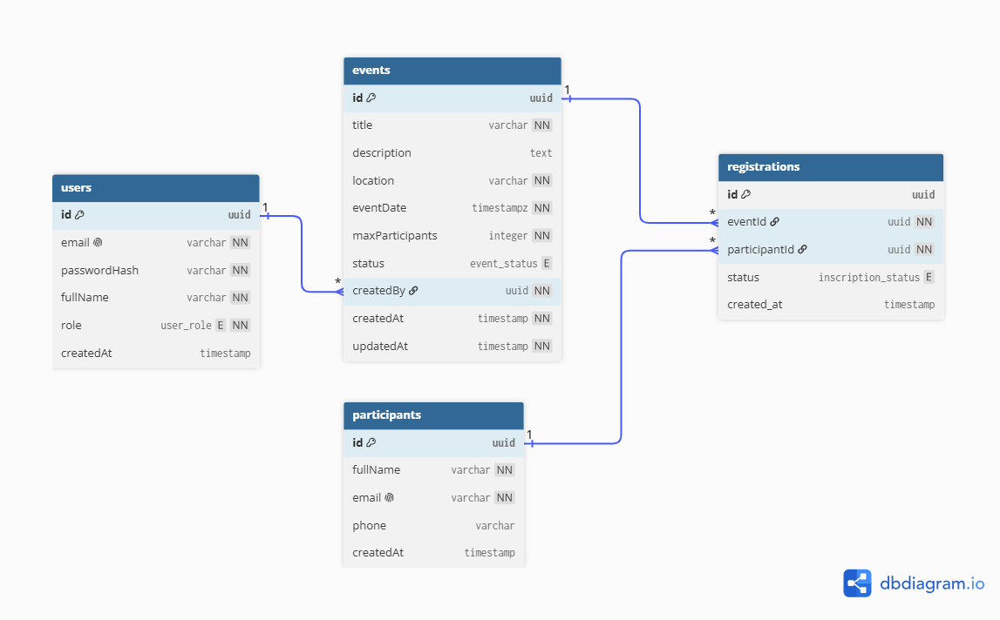

# EventHub

Application web de gestion d’événements et d’inscriptions (stack **PERN** : PostgreSQL, Express, React, Node.js).

## Fonctionnalités

- Authentification JWT avec rôles `admin` et `staff`
- Gestion des utilisateurs (admin) : liste + création
- Gestion des événements (`draft` / `published` / `cancelled`)
  - création, modification, publication / annulation
  - filtres par `status` et `date`
- Gestion des participants (création, modification, recherche)
- Inscriptions (relation N-N événement ↔ participant) + règles métier
- Dashboard statistiques (`totalEvents`, `publishedEvents`, `registrationsToday`, `topEvents`)
- Frontend React (Vite) + Tailwind, avec proxy `/api` vers le backend

## Structure du projet

```text
.
├── app/
│   ├── api/          # Backend Express + Prisma
│   └── web/          # Frontend React (Vite + Tailwind)
├── EventHub/         # Collection Bruno (tests API)
├── docs/             # Cahier des charges (suivi) + ERD
├── .gitignore
└── README.md
```

## Prérequis

- Node.js (LTS recommandé)
- PostgreSQL
- npm

## Installation

### 1. Cloner le dépôt

#### Cloner en SSH

```bash
git clone git@github.com:AHLALLAY/EventHub_Tython.git
cd EventHub_Tython
```

#### Cloner en HTTPS

```bash
git clone https://github.com/AHLALLAY/EventHub_Tython.git
cd EventHub_Tython
```

### 2. Backend (`app/api`)

```bash
cd app/api
npm install
cp .env.example .env
```

Édite ensuite `.env` avec tes valeurs locales (base PostgreSQL, secret JWT, etc.).

| Variable | Description |
|---|---|
| `PORT` | Port de l’API (ex. `3000`) |
| `API_BASE_URL` | Préfixe des routes (ex. `/api`) |
| `DATABASE_URL` | URL de connexion PostgreSQL |
| `JWT_SECRET` | Clé secrète pour les tokens |
| `JWT_EXPIRES_IN` | Durée de validité du token (ex. `15m`) |
| `CORS_ORIGIN` | Origine autorisée (ex. `http://localhost:5173`) |
| `BCRYPT_SALT_ROUNDS` | Nombre de rounds bcrypt |

Puis initialise Prisma, peupler la base et démarre l’API :

```bash
npx prisma generate
npx prisma db push
npm run db:seed
npm run dev
```

L’API écoute par défaut sur `http://localhost:3000`.

#### Comptes de test (seed)

| Rôle | Email | Mot de passe |
|---|---|---|
| admin | `admin@eventhub.com` | `Admin123!` |
| staff | `staff@eventhub.com` | `Staff123!` |

### 3. Frontend (`app/web`)

```bash
cd app/web
npm install
```

### 4. Lancer API + frontend (même terminal)

À la racine du projet :

```bash
npm install
npm run dev
```

- API : `http://localhost:3000`
- Web : `http://localhost:5173`

En développement, Vite proxy les appels `/api` vers `http://localhost:3000` (voir `app/web/vite.config.js`).  
Tu peux aussi définir `VITE_API_URL` si besoin.

Pour lancer séparément : `npm run dev:api` ou `npm run dev:web`.

## Scripts utiles

### Racine

| Commande | Description |
|---|---|
| `npm run dev` | Lance API + frontend ensemble (`concurrently`) |
| `npm run dev:api` | Lance uniquement l’API |
| `npm run dev:web` | Lance uniquement le frontend |
| `npm run install:all` | Installe les deps racine + api + web |

### API (`app/api`)

| Commande | Description |
|---|---|
| `npm run dev` | Serveur Express avec rechargement |
| `npm run db:generate` | Génère le client Prisma |
| `npm run db:push` | Applique le schéma à la base |
| `npm run db:seed` | Charge les données de test |
| `npm run db:studio` | Ouvre Prisma Studio |

### Web (`app/web`)

| Commande | Description |
|---|---|
| `npm run dev` | Serveur de développement Vite |
| `npm run build` | Build de production |
| `npm run preview` | Prévisualisation du build |
| `npm run lint` | Vérification ESLint |

## API (aperçu)

Base : `http://localhost:3000/api`

- Auth : `POST /auth/login`, `GET /auth/me`
- Users (admin) : `POST /users`, `GET /users`
- Events : `POST/GET/PUT /events`, `PATCH /events/:id/status` (`?status=&date=`)
- Participants : `POST/GET /participants`, `PUT /participants/:id` (`?search=`)
- Registrations : `POST/GET /registrations`, `PATCH /registrations/:id/status`
- Dashboard : `GET /dashboard/stats`

Collection Bruno : dossier `EventHub/`.

## Schéma ERD

Diagramme entité-relation du projet :



## Modèle de données (aperçu)

Tables principales (`app/api/prisma/schema.prisma`) :

- `users`
- `events`
- `participants`
- `registrations`

Le suivi d’avancement du sujet se fait dans `docs/EventHub.md` (cases à cocher).  

## État actuel

Backend et frontend livrables pour le sujet EventHub : auth/rôles, users admin, events, participants, inscriptions, dashboard, UI React + Tailwind.

## Auteur

Abderrahmane Ahlallay
